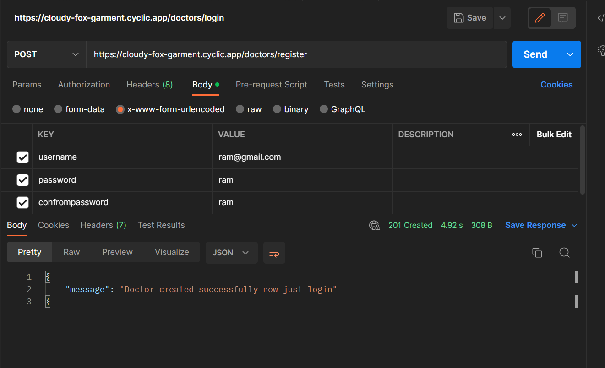
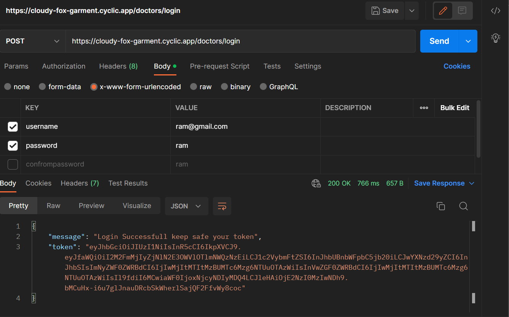
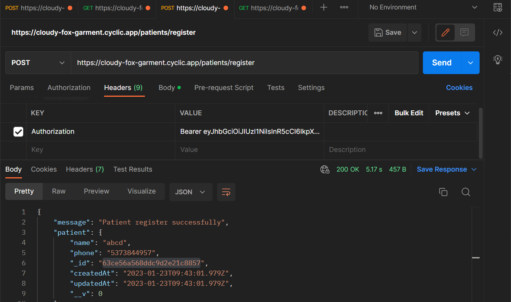
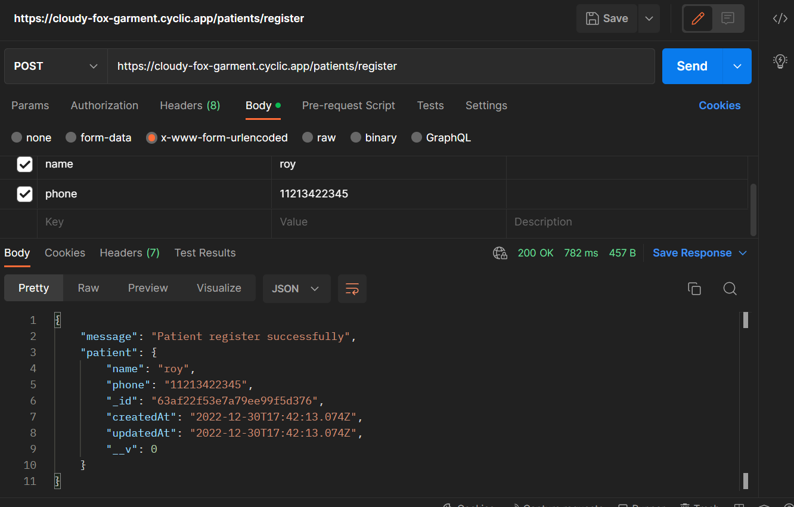
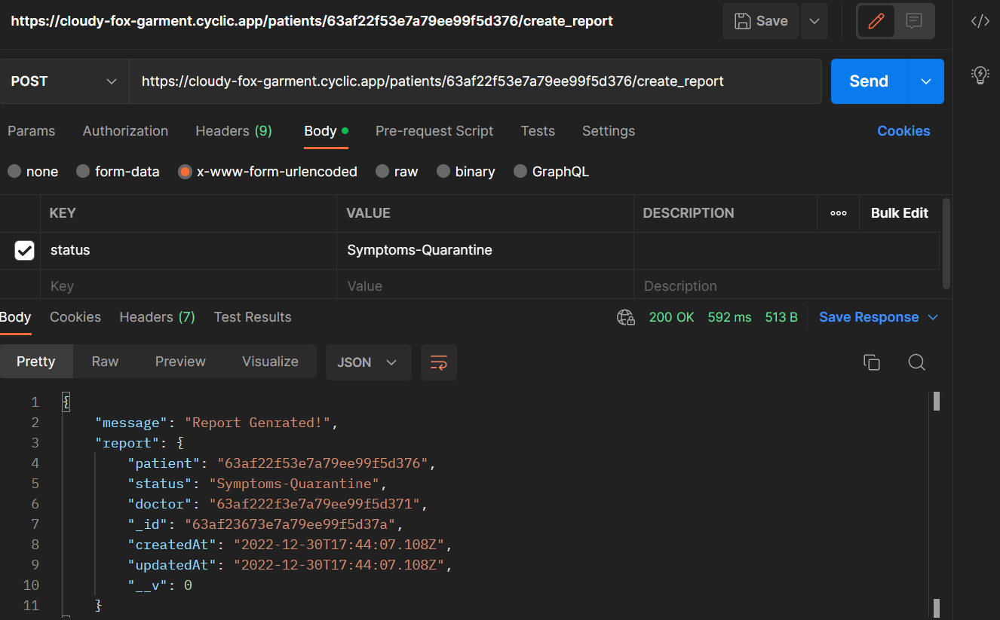
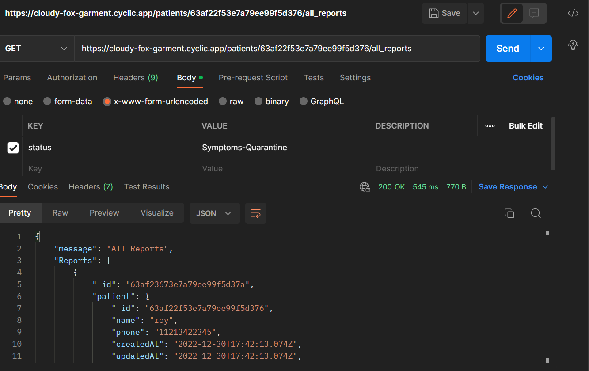
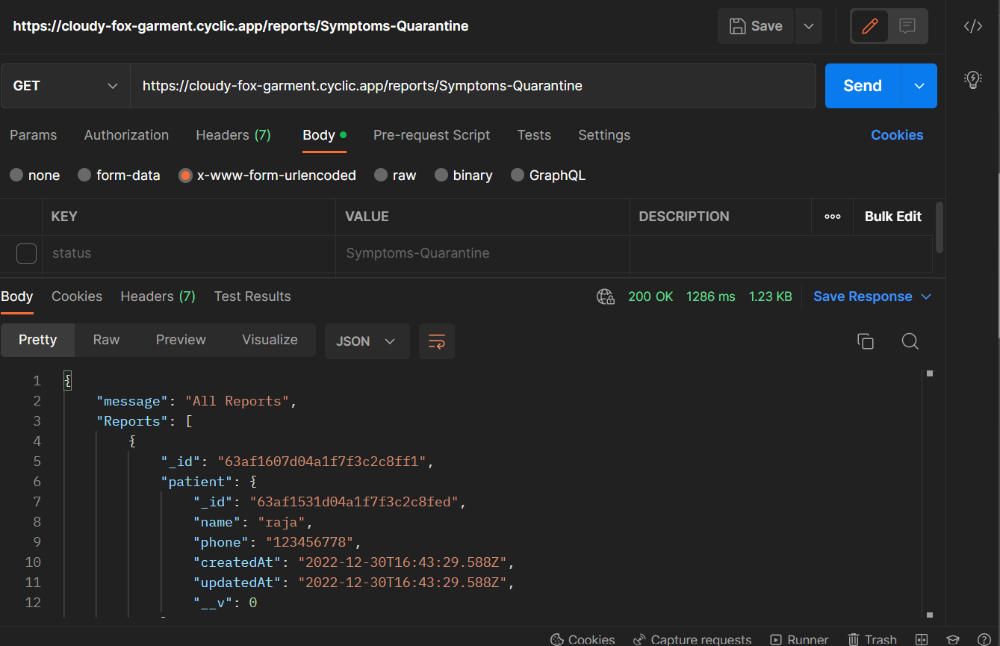

# hospital-api
We’re going to design an API for the doctors of a Hospital which has been allocated by the govt for testing and quarantine + well being of COVID-19 patients

##Functionality
1. here Two Types of user
  A.Doctor
  B.Patient
2. Doctors can sign in and sign out
3. register patient
4. genrate report 
5. check all report to patient
6. check all report status wise 

##Tools 
1. Node Js  v-16.18.0
2. Express Js
3. Mongodb  v-5.0.13
4. Mongoose
5. passport JWT (for authentication purpose)

##Setup in Local System

1. clone the repo in your System.
2. go to folder you want open cmd/power shell/git-bash. 
3. then just run:- git clone https://github.com/tush8788/hospital-api.git
4. after download done 
5. open command prompt and Type 'npm install' for download all dependencies 
6. then just "npm start"/ if npm start is not work just run this command 'node index.js'
7. then go localhost:8000

## This Site is hosted on cyclic.sh
1. Access link "https://cloudy-fox-garment.cyclic.app"

##Screen Short
1. Register Doctor

2. Login Doctor

3. Set Token for Authorise request inside header of all requests

4. Register Patient

5. Genrate Report useing Patient by Doctor

6. show all reports of patient

7. show all reports of status wise

